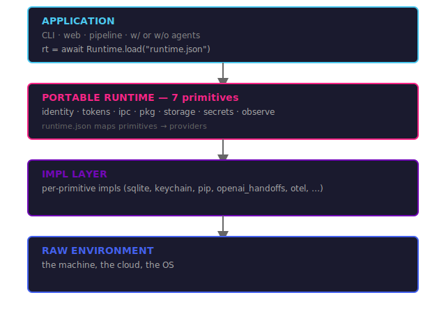

# The Portable Runtime

A research note motivating the design of pyxen.

## The problem

You build an impressive app with openclaw (or any agentic framework). It wires together LLMs, tools, storage, secrets, cron jobs, and identity — all managed by openclaw on your local machine. It works great. Then you try to share it.

You can't. Your friend needs different config paths. Your CI needs different secrets. Deploying to the cloud means different auth, different storage backends, different everything. The app is fused to your environment.

This isn't a framework problem — it's an *environment coupling* problem. The app knows too much about *where* it runs.

## What it is

A library, a config file, a set of interfaces. Every environment-shaped call (`identity()`, `storage()`, `secrets()`) routes to a pluggable *provider* configured in `runtime.json`. Swap the file, swap the environment — zero code changes.

The runtime is not a layer above agents or SDKs. It's the interface the *application* uses. The app shell and any embedded agents share one runtime. **Intertwined, not layered.**

## How it solves environment coupling

The app calls `rt.secrets.get("DATABASE_URL")` — it doesn't know or care whether that resolves from `.env`, Vault, or AWS Secrets Manager. `runtime.json` maps each primitive to a provider. Swap the file, the app moves. Same binary, different environment.

## Prior art

Each of these captures one piece; none compose all seven:

- **WASI** — portable OS interface for Wasm
- **OpenAI Agents SDK** — Manifest abstraction for portable sandboxes
- **OpenHands SDK** — workspace abstraction
- **Agent Auth Protocol** — cryptographic per-agent identity
- **Microsoft Agent Framework 1.0** — tools decoupled from OS
- **Dagger Functions** — provider-swappable sandbox SDK
- **Nix** — declarative environments-as-code

> **The gap:** The Portable Runtime composes all seven behind a single `runtime.json`, consuming existing pieces rather than reimplementing them.

## The bet

The problem is real today. Every agentic app hits environment coupling the moment you try to share or deploy it. pyxen ships as a pip package. The 7 primitives are what apps actually need. When OS-level abstractions catch up, the runtime can use them as providers — but you don't need to wait.
